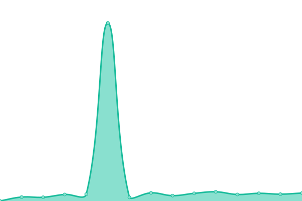

# [📈 Live Status](https://demo.upptime.js.org): <!--live status--> **🟩 All systems operational**

This repository contains the open-source uptime monitor and status page for [Upptime](https://upptime.js.org), powered by [Upptime](https://github.com/upptime/upptime).

With [Upptime](https://upptime.js.org), you can get your own unlimited and free uptime monitor and status page, powered entirely by a GitHub repository. We use [Issues](https://github.com/upptime/upptime/issues) as incident reports, [Actions](https://github.com/AlonsoK28/amzmation-upptime/actions) as uptime monitors, and [Pages](https://demo.upptime.js.org) for the status page.

<!--start: status pages-->
<!-- This summary is generated by Upptime (https://github.com/upptime/upptime) -->
<!-- Do not edit this manually, your changes will be overwritten -->
<!-- prettier-ignore -->
| URL | Status | History | Response Time | Uptime |
| --- | ------ | ------- | ------------- | ------ |
|  [Lastest offers](https://us-central1-amazmation.cloudfunctions.net/api/getOffers) | 🟩 Up | [lastest-offers.yml](https://github.com/AlonsoK28/amzmation-upptime/commits/HEAD/history/lastest-offers.yml) | 

 527ms
     
 | 

<a href="https://AlonsoK28.github.io/amzmation-upptime/history/lastest-offers">100.00%</a>
    

|  [Offers by department computers and accessories](https://us-central1-amazmation.cloudfunctions.net/api/getOffersByDepartmentComputersAndAccessories) | 🟩 Up | [offers-by-department-computers-and-accessories.yml](https://github.com/AlonsoK28/amzmation-upptime/commits/HEAD/history/offers-by-department-computers-and-accessories.yml) | 

 144ms
     
 | 

<a href="https://AlonsoK28.github.io/amzmation-upptime/history/offers-by-department-computers-and-accessories">100.00%</a>
    

|  [Offers by department electronic accessories](https://us-central1-amazmation.cloudfunctions.net/api/getOffersByDepartmentElectronicAccessories) | 🟩 Up | [offers-by-department-electronic-accessories.yml](https://github.com/AlonsoK28/amzmation-upptime/commits/HEAD/history/offers-by-department-electronic-accessories.yml) | 

 152ms
     
 | 

<a href="https://AlonsoK28.github.io/amzmation-upptime/history/offers-by-department-electronic-accessories">100.00%</a>
    

|  [Offers by department games and toys](https://us-central1-amazmation.cloudfunctions.net/api/getOffersByDepartmentGamesAndToys) | 🟩 Up | [offers-by-department-games-and-toys.yml](https://github.com/AlonsoK28/amzmation-upptime/commits/HEAD/history/offers-by-department-games-and-toys.yml) | 

 135ms
     
 | 

<a href="https://AlonsoK28.github.io/amzmation-upptime/history/offers-by-department-games-and-toys">100.00%</a>
    

|  [Offers by department beauty](https://us-central1-amazmation.cloudfunctions.net/api/getOffersByDepartmentBeauty) | 🟩 Up | [offers-by-department-beauty.yml](https://github.com/AlonsoK28/amzmation-upptime/commits/HEAD/history/offers-by-department-beauty.yml) | 

 140ms
     
 | 

<a href="https://AlonsoK28.github.io/amzmation-upptime/history/offers-by-department-beauty">100.00%</a>
    

|  [Offers by department home and kitchen](https://us-central1-amazmation.cloudfunctions.net/api/getOffersByDepartmentHomeAndKitchen) | 🟩 Up | [offers-by-department-home-and-kitchen.yml](https://github.com/AlonsoK28/amzmation-upptime/commits/HEAD/history/offers-by-department-home-and-kitchen.yml) | 

 135ms
     
 | 

<a href="https://AlonsoK28.github.io/amzmation-upptime/history/offers-by-department-home-and-kitchen">100.00%</a>
    

|  [Offers by department beauty](https://us-central1-amazmation.cloudfunctions.net/api/getOffersByDepartmentBeauty) | 🟩 Up | [offers-by-department-beauty.yml](https://github.com/AlonsoK28/amzmation-upptime/commits/HEAD/history/offers-by-department-beauty.yml) | 

 140ms
     
 | 

<a href="https://AlonsoK28.github.io/amzmation-upptime/history/offers-by-department-beauty">100.00%</a>
    

|  [Offers by department fashion](https://us-central1-amazmation.cloudfunctions.net/api/getOffersByDepartmentFashion) | 🟩 Up | [offers-by-department-fashion.yml](https://github.com/AlonsoK28/amzmation-upptime/commits/HEAD/history/offers-by-department-fashion.yml) | 

 126ms
     
 | 

<a href="https://AlonsoK28.github.io/amzmation-upptime/history/offers-by-department-fashion">100.00%</a>
    

|  [Offers by department furnitures](https://us-central1-amazmation.cloudfunctions.net/api/getOffersByDepartmentFurnitures) | 🟩 Up | [offers-by-department-furnitures.yml](https://github.com/AlonsoK28/amzmation-upptime/commits/HEAD/history/offers-by-department-furnitures.yml) | 

 132ms
     
 | 

<a href="https://AlonsoK28.github.io/amzmation-upptime/history/offers-by-department-furnitures">100.00%</a>
    

|  [Offers by department outdoor sports](https://us-central1-amazmation.cloudfunctions.net/api/getOffersByDepartmentOutdoorSports) | 🟩 Up | [offers-by-department-outdoor-sports.yml](https://github.com/AlonsoK28/amzmation-upptime/commits/HEAD/history/offers-by-department-outdoor-sports.yml) | 

 118ms
     
 | 

<a href="https://AlonsoK28.github.io/amzmation-upptime/history/offers-by-department-outdoor-sports">100.00%</a>
    

|  [Offers by department tv and video](https://us-central1-amazmation.cloudfunctions.net/api/getOffersByDepartmentTvAndVideo) | 🟩 Up | [offers-by-department-tv-and-video.yml](https://github.com/AlonsoK28/amzmation-upptime/commits/HEAD/history/offers-by-department-tv-and-video.yml) | 

 186ms
     
 | 

<a href="https://AlonsoK28.github.io/amzmation-upptime/history/offers-by-department-tv-and-video">100.00%</a>
    

|  [Offers by department books](https://us-central1-amazmation.cloudfunctions.net/api/getOffersByDepartmentBooks) | 🟩 Up | [offers-by-department-books.yml](https://github.com/AlonsoK28/amzmation-upptime/commits/HEAD/history/offers-by-department-books.yml) | 

 118ms
     
 | 

<a href="https://AlonsoK28.github.io/amzmation-upptime/history/offers-by-department-books">100.00%</a>
    

|  [Offers by department cellphoners and accessories](https://us-central1-amazmation.cloudfunctions.net/api/getOffersByDepartmentCellphonesAndAccessories) | 🟩 Up | [offers-by-department-cellphoners-and-accessories.yml](https://github.com/AlonsoK28/amzmation-upptime/commits/HEAD/history/offers-by-department-cellphoners-and-accessories.yml) | 

 147ms
     
 | 

<a href="https://AlonsoK28.github.io/amzmation-upptime/history/offers-by-department-cellphoners-and-accessories">100.00%</a>
    

|  [Offers by department personal care](https://us-central1-amazmation.cloudfunctions.net/api/getOffersByDepartmentPersonalCare) | 🟩 Up | [offers-by-department-personal-care.yml](https://github.com/AlonsoK28/amzmation-upptime/commits/HEAD/history/offers-by-department-personal-care.yml) | 

 111ms
     
 | 

<a href="https://AlonsoK28.github.io/amzmation-upptime/history/offers-by-department-personal-care">100.00%</a>
    

|  [Offers by department home improvements](https://us-central1-amazmation.cloudfunctions.net/api/getOffersByDepartmentHomeImprovements) | 🟩 Up | [offers-by-department-home-improvements.yml](https://github.com/AlonsoK28/amzmation-upptime/commits/HEAD/history/offers-by-department-home-improvements.yml) | 

 164ms
     
 | 

<a href="https://AlonsoK28.github.io/amzmation-upptime/history/offers-by-department-home-improvements">100.00%</a>
    

|  [Offers by department videogames](https://us-central1-amazmation.cloudfunctions.net/api/getOffersByDepartmentVideogames) | 🟩 Up | [offers-by-department-videogames.yml](https://github.com/AlonsoK28/amzmation-upptime/commits/HEAD/history/offers-by-department-videogames.yml) | 

 120ms
     
 | 

<a href="https://AlonsoK28.github.io/amzmation-upptime/history/offers-by-department-videogames">100.00%</a>
    

|  [Offers by department cameras and photography](https://us-central1-amazmation.cloudfunctions.net/api/getOffersByDepartmentCamerasAndPhotography) | 🟩 Up | [offers-by-department-cameras-and-photography.yml](https://github.com/AlonsoK28/amzmation-upptime/commits/HEAD/history/offers-by-department-cameras-and-photography.yml) | 

 146ms
     
 | 

<a href="https://AlonsoK28.github.io/amzmation-upptime/history/offers-by-department-cameras-and-photography">100.00%</a>
    

|  [Offers by department bags and suitcases](https://us-central1-amazmation.cloudfunctions.net/api/getOffersByDepartmentBagsAndSuitcases) | 🟩 Up | [offers-by-department-bags-and-suitcases.yml](https://github.com/AlonsoK28/amzmation-upptime/commits/HEAD/history/offers-by-department-bags-and-suitcases.yml) | 

 113ms
     
 | 

<a href="https://AlonsoK28.github.io/amzmation-upptime/history/offers-by-department-bags-and-suitcases">100.00%</a>
    

<!--end: status pages-->

[**Go to amzmation-upptime status website →**](https://alonsok28.github.io/amzmation-upptime/)

## 📄 License

- Powered by: [Upptime](https://github.com/upptime/upptime)
- Code: [MIT](./LICENSE) © [Upptime](https://upptime.js.org)
- Data in the `./history` directory: [Open Database License](https://opendatacommons.org/licenses/odbl/1-0/)
